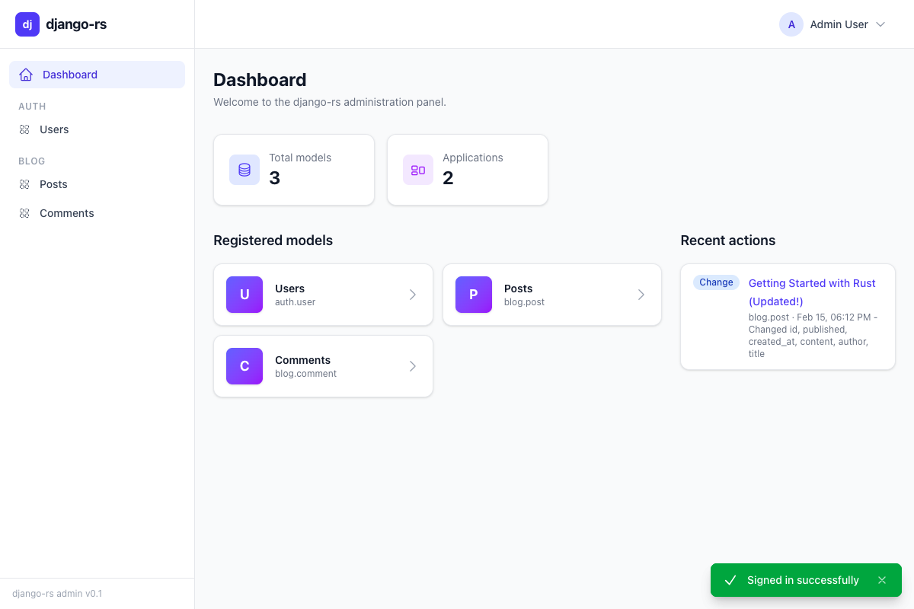

# Introduction

Welcome to the **django-rs** tutorial book. This guide will walk you through building a complete web application from scratch using django-rs, a full-featured web framework for Rust inspired by Python's Django.

Whether you are a Rust developer looking for a batteries-included web framework or a Django developer exploring Rust, this book is for you.

## What is django-rs?

django-rs brings Django's proven design philosophy -- "the web framework for perfectionists with deadlines" -- to the Rust ecosystem. It is a modular, async-first framework composed of **15 crates** totaling approximately **94,000 lines of Rust code**, covering everything from HTTP handling and URL routing to an ORM, template engine, form validation, authentication, and a built-in admin panel.

The 15 crates that make up django-rs are:

| Crate | Purpose |
|-------|---------|
| `django-rs` | The umbrella crate that re-exports everything |
| `django-rs-http` | HTTP request/response handling, URL routing, path converters, reverse resolution |
| `django-rs-db` | ORM with async database queries, model definitions, querysets |
| `django-rs-db-backends` | Database backend drivers (PostgreSQL, SQLite) |
| `django-rs-db-migrations` | Schema migration system |
| `django-rs-admin` | Built-in admin panel with CRUD interface |
| `django-rs-template` | Django Template Language (DTL)-compatible template engine |
| `django-rs-forms` | Form definitions, field types, and validation |
| `django-rs-views` | Generic views and class-based view patterns |
| `django-rs-auth` | Authentication and authorization |
| `django-rs-core` | Core utilities shared across crates |
| `django-rs-signals` | Signal/event dispatch system |
| `django-rs-macros` | Procedural macros for models, forms, and more |
| `django-rs-test` | Test framework and test client |
| `django-rs-cli` | Command-line management tool |

If you have experience with Django in Python, you will find many familiar concepts here -- models, views, templates, forms, and the admin interface -- all adapted to take full advantage of Rust's type safety, zero-cost abstractions, and async/await runtime.

## What you will build

Over the course of five tutorials, you will build a **blog application with an admin panel**. By the end, you will have a working application that supports creating, reading, updating, and deleting blog posts, complete with form validation, a template-driven frontend, and a full test suite.

Here is a preview of the admin panel you will have running by the end of Tutorial 2:

The admin panel provides a full CRUD interface out of the box -- no custom code required -- just like Django's admin.

## Prerequisites

Before starting, make sure you have the following:

- **Rust 1.75 or later** -- django-rs relies on features stabilized in this release, including `async fn` in traits. Install or update Rust via [rustup](https://rustup.rs/).
- **Basic Rust knowledge** -- You should be comfortable with ownership, traits, structs, enums, and async/await. The [Rust Book](https://doc.rust-lang.org/book/) is an excellent resource if you need a refresher.
- **Familiarity with web concepts** -- A general understanding of HTTP, request/response cycles, HTML, and relational databases will help you follow along.

No prior Django experience is needed, but if you have it, you will feel right at home.

## Tutorial overview

The tutorials are structured into **five parts**, each building on the previous one. They mirror [Django's official tutorial](https://docs.djangoproject.com/en/stable/intro/tutorial01/) structure, adapted for Rust and django-rs conventions.

1. **[Tutorial 1: Getting Started](./tutorial/01-getting-started.md)** -- Set up a new django-rs project, write your first HTTP handler, define URL routes with path converters, and run a development server.

2. **[Tutorial 2: Models and the Admin Panel](./tutorial/02-models-and-admin.md)** -- Define models with the ORM, run migrations to create your database schema, and register models with the built-in admin interface.

3. **[Tutorial 3: Views and Templates](./tutorial/03-views-and-templates.md)** -- Write views that query the database and render HTML responses using django-rs's DTL-compatible template engine.

4. **[Tutorial 4: Forms and Validation](./tutorial/04-forms-and-validation.md)** -- Build forms with typed field definitions, handle form submission, and apply validation rules.

5. **[Tutorial 5: Testing Your App](./tutorial/05-testing.md)** -- Write tests using the built-in test framework and test client, covering both model logic and view behavior.

Each tutorial builds on the previous one, so it is best to work through them in order. That said, each tutorial begins with a brief summary of where you should be, so you can jump ahead if needed.

## Key features of django-rs

- **Async/await throughout** -- Every layer of the framework is built on async Rust, from request handling to database queries to template rendering.
- **Type safety** -- Rust's type system catches entire categories of bugs at compile time that would be runtime errors in dynamic languages. Invalid URL patterns, mismatched form fields, and missing template variables become compiler errors.
- **15 modular crates** -- Use only what you need. The framework is split into focused crates that compose cleanly, so you can use the HTTP layer without the ORM, or the template engine without the admin.
- **Django compatibility** -- Familiar concepts, naming conventions, and patterns. If you know Django, you already know most of django-rs.
- **Performance** -- Rust's zero-cost abstractions and lack of garbage collection mean django-rs applications are fast by default, without sacrificing developer ergonomics.

## Source code

The django-rs source code and this tutorial are available on GitHub:

[https://github.com/snejati86/django-rs](https://github.com/snejati86/django-rs)

The complete source for the blog application built in these tutorials is in the `examples/blog/` directory.

---

Ready to get started? Head to **[Tutorial 1: Getting Started](./tutorial/01-getting-started.md)**.
