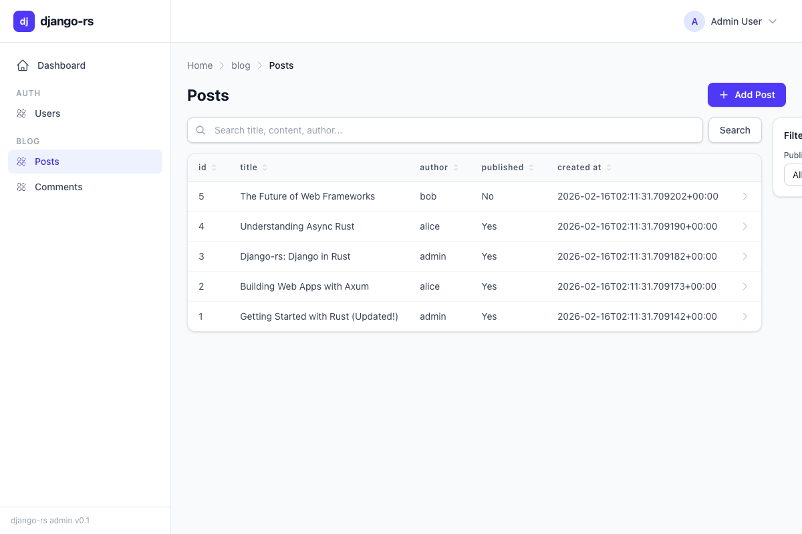
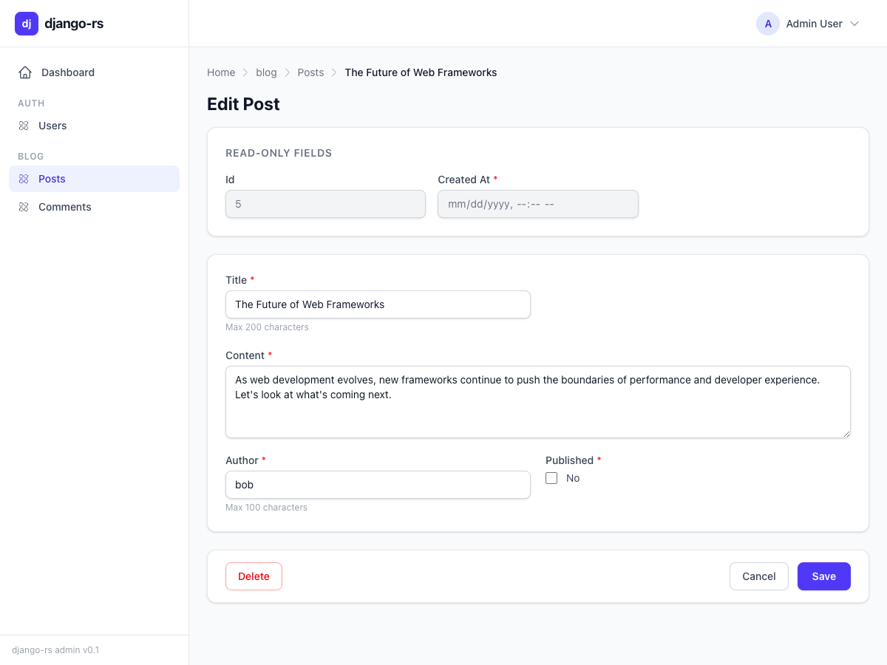
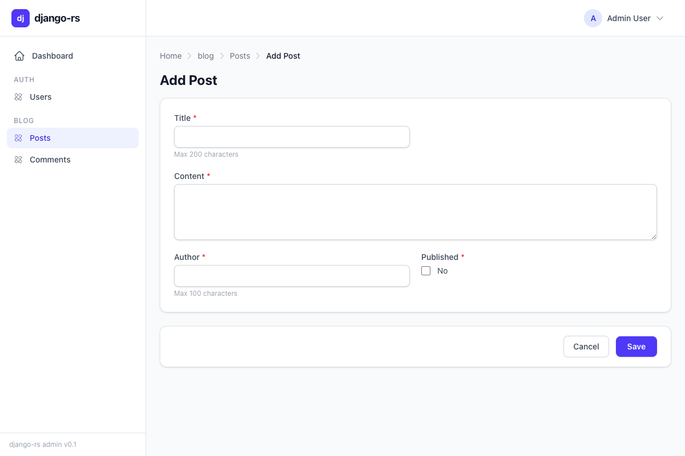

# Tutorial 2: Models and the Admin Panel

The admin panel is the crown jewel of django-rs. Just like Django's admin -- which has been called "Django's killer feature" -- django-rs provides a fully functional, production-ready CRUD interface out of the box. But unlike Django, the django-rs admin is powered by a **React frontend** backed by a **REST API** generated entirely from your Rust model definitions.

In this tutorial you will define database models, register them with the admin panel, seed data, and launch a working admin dashboard. By the end, you will have a complete admin interface with search, filtering, pagination, inline editing, and an audit trail -- all from about 150 lines of Rust code.

This tutorial mirrors [Django's Tutorial Part 2](https://docs.djangoproject.com/en/stable/intro/tutorial02/) and [Part 7](https://docs.djangoproject.com/en/stable/intro/tutorial07/).

---

## Prerequisites

Make sure you have completed [Tutorial 1: Getting Started](./01-getting-started.md). Your `Cargo.toml` should include at minimum:

```toml
[package]
name = "blog"
version = "0.1.0"
edition = "2021"

[dependencies]
django-rs = { path = "../django-rs" }
django-rs-admin = { path = "../crates/django-rs-admin" }
django-rs-db = { path = "../crates/django-rs-db" }
axum = "0.8"
tokio = { version = "1", features = ["full"] }
serde = { version = "1", features = ["derive"] }
serde_json = "1"
tower-http = { version = "0.6", features = ["cors"] }
tracing = "0.1"
tracing-subscriber = { version = "0.3", features = ["env-filter"] }
```

---

## Part 1: Defining Models with the ORM

### Field Types

Every database column in django-rs is described by a `FieldDef` that pairs a field name with a `FieldType`. The type system mirrors Django's field classes and maps directly to SQL column types:

| FieldType | SQL (PostgreSQL) | Django Equivalent |
|-----------|-----------------|-------------------|
| `AutoField` | `SERIAL` | `AutoField` |
| `BigAutoField` | `BIGSERIAL` | `BigAutoField` |
| `CharField` | `VARCHAR` | `CharField` |
| `TextField` | `TEXT` | `TextField` |
| `IntegerField` | `INTEGER` | `IntegerField` |
| `BigIntegerField` | `BIGINT` | `BigIntegerField` |
| `SmallIntegerField` | `SMALLINT` | `SmallIntegerField` |
| `FloatField` | `DOUBLE PRECISION` | `FloatField` |
| `DecimalField` | `NUMERIC(m, d)` | `DecimalField` |
| `BooleanField` | `BOOLEAN` | `BooleanField` |
| `DateField` | `DATE` | `DateField` |
| `DateTimeField` | `TIMESTAMP` | `DateTimeField` |
| `TimeField` | `TIME` | `TimeField` |
| `DurationField` | `INTERVAL` | `DurationField` |
| `UuidField` | `UUID` | `UUIDField` |
| `EmailField` | `VARCHAR` | `EmailField` |
| `UrlField` | `VARCHAR` | `URLField` |
| `SlugField` | `VARCHAR` | `SlugField` |
| `JsonField` | `JSONB` | `JSONField` |
| `BinaryField` | `BYTEA` | `BinaryField` |
| `IpAddressField` | `INET` | `GenericIPAddressField` |
| `ForeignKey` | `INTEGER` | `ForeignKey` |
| `OneToOneField` | `INTEGER` | `OneToOneField` |
| `ManyToManyField` | *(junction table)* | `ManyToManyField` |

PostgreSQL-specific types are also available: `ArrayField`, `HStoreField`, `IntegerRangeField`, `BigIntegerRangeField`, `FloatRangeField`, `DateRangeField`, `DateTimeRangeField`, and `GeneratedField`.

### FieldDef: The Builder Pattern

Each field is described by a `FieldDef`, which uses a builder pattern to configure constraints and metadata. Here is every option available:

```rust
use django_rs_db::fields::{FieldDef, FieldType, OnDelete};
use django_rs_db::value::Value;

// Auto-incrementing primary key
FieldDef::new("id", FieldType::BigAutoField)
    .primary_key()

// A string field with max length
FieldDef::new("title", FieldType::CharField)
    .max_length(200)
    .verbose_name("Post Title")
    .help_text("The title displayed in listings")

// A nullable text field
FieldDef::new("summary", FieldType::TextField)
    .nullable()

// A unique slug with a database index
FieldDef::new("slug", FieldType::SlugField)
    .max_length(200)
    .unique()
    .db_index()

// A boolean field with a default value
FieldDef::new("published", FieldType::BooleanField)
    .default(Value::Bool(false))

// A foreign key relationship
FieldDef::new("author_id", FieldType::ForeignKey {
    to: "auth.User".into(),
    on_delete: OnDelete::Cascade,
    related_name: Some("posts".into()),
})

// A decimal field for prices
FieldDef::new("price", FieldType::DecimalField {
    max_digits: 10,
    decimal_places: 2,
})

// Override the database column name
FieldDef::new("email", FieldType::EmailField)
    .column("email_address")
    .max_length(254)
    .unique()
    .db_index()
```

The complete `FieldDef` builder API:

| Method | Description |
|--------|-------------|
| `.primary_key()` | Marks the field as the primary key |
| `.nullable()` | Allows `NULL` in the database |
| `.max_length(n)` | Sets maximum character length |
| `.unique()` | Adds a `UNIQUE` constraint |
| `.db_index()` | Creates a database index on this column |
| `.default(value)` | Sets a default value (`Value::Bool(false)`, `Value::Int(0)`, etc.) |
| `.column("name")` | Overrides the database column name |
| `.verbose_name("Label")` | Human-readable name for forms and admin |
| `.help_text("...")` | Help text displayed in forms |

### The OnDelete Behavior

When defining `ForeignKey` or `OneToOneField`, you specify what happens when the referenced object is deleted:

| `OnDelete` Variant | SQL | Description |
|--------------------|-----|-------------|
| `OnDelete::Cascade` | `ON DELETE CASCADE` | Delete all related objects |
| `OnDelete::Protect` | `ON DELETE RESTRICT` | Prevent deletion if related objects exist |
| `OnDelete::SetNull` | `ON DELETE SET NULL` | Set the foreign key to `NULL` |
| `OnDelete::SetDefault` | `ON DELETE SET DEFAULT` | Set to the field's default value |
| `OnDelete::DoNothing` | `ON DELETE NO ACTION` | Take no action (may cause integrity errors) |

### The Model Trait

Every model is a Rust struct that implements the `Model` trait. This is analogous to subclassing `django.db.models.Model` in Python:

```rust
use django_rs_db::fields::{FieldDef, FieldType};
use django_rs_db::model::{Model, ModelMeta};
use django_rs_db::query::compiler::{InheritanceType, OrderBy, Row};
use django_rs_db::value::Value;
use django_rs_core::DjangoError;
use std::sync::LazyLock;

/// A blog post.
pub struct Post {
    pub id: i64,
    pub title: String,
    pub slug: String,
    pub content: String,
    pub author: String,
    pub published: bool,
    pub created_at: String,
    pub updated_at: String,
}

impl Model for Post {
    fn meta() -> &'static ModelMeta {
        static META: LazyLock<ModelMeta> = LazyLock::new(|| ModelMeta {
            app_label: "blog",
            model_name: "post",
            db_table: "blog_post".to_string(),
            verbose_name: "post".to_string(),
            verbose_name_plural: "posts".to_string(),
            ordering: vec![OrderBy::desc("created_at")],
            unique_together: vec![],
            indexes: vec![],
            abstract_model: false,
            fields: vec![
                FieldDef::new("id", FieldType::BigAutoField).primary_key(),
                FieldDef::new("title", FieldType::CharField).max_length(200),
                FieldDef::new("slug", FieldType::SlugField)
                    .max_length(200)
                    .unique()
                    .db_index(),
                FieldDef::new("content", FieldType::TextField),
                FieldDef::new("author", FieldType::CharField).max_length(100),
                FieldDef::new("published", FieldType::BooleanField)
                    .default(Value::Bool(false)),
                FieldDef::new("created_at", FieldType::DateTimeField),
                FieldDef::new("updated_at", FieldType::DateTimeField),
            ],
            constraints: vec![],
            inheritance_type: InheritanceType::None,
        });
        &META
    }

    fn table_name() -> &'static str { "blog_post" }
    fn app_label() -> &'static str { "blog" }

    fn pk(&self) -> Option<&Value> {
        if self.id == 0 { None } else { Some(&Value::Int(0)) }
    }

    fn set_pk(&mut self, value: Value) {
        if let Value::Int(id) = value { self.id = id; }
    }

    fn field_values(&self) -> Vec<(&'static str, Value)> {
        vec![
            ("id", Value::Int(self.id)),
            ("title", Value::String(self.title.clone())),
            ("slug", Value::String(self.slug.clone())),
            ("content", Value::String(self.content.clone())),
            ("author", Value::String(self.author.clone())),
            ("published", Value::Bool(self.published)),
            ("created_at", Value::String(self.created_at.clone())),
            ("updated_at", Value::String(self.updated_at.clone())),
        ]
    }

    fn from_row(row: &Row) -> Result<Self, DjangoError> {
        Ok(Post {
            id: row.get::<i64>("id")?,
            title: row.get::<String>("title")?,
            slug: row.get::<String>("slug")?,
            content: row.get::<String>("content")?,
            author: row.get::<String>("author")?,
            published: row.get::<bool>("published")?,
            created_at: row.get::<String>("created_at")?,
            updated_at: row.get::<String>("updated_at")?,
        })
    }
}
```

### ModelMeta: The Equivalent of Django's class Meta

The `ModelMeta` struct captures everything Django stores in `class Meta`:

| Field | Description | Django Equivalent |
|-------|-------------|-------------------|
| `app_label` | The application name | Inferred from module path |
| `model_name` | Lowercase model name | Inferred from class name |
| `db_table` | The database table name | `db_table` |
| `verbose_name` | Human-readable singular name | `verbose_name` |
| `verbose_name_plural` | Human-readable plural name | `verbose_name_plural` |
| `ordering` | Default query ordering | `ordering` |
| `unique_together` | Multi-column uniqueness constraints | `unique_together` |
| `indexes` | Database indexes | `indexes` |
| `abstract_model` | If `true`, no table is created | `abstract = True` |
| `constraints` | CHECK and UNIQUE constraints | `constraints` |
| `inheritance_type` | None, MultiTable, or Proxy | Determined by class hierarchy |

### Adding a Comment Model with a ForeignKey

Let us add a related model to demonstrate relationships:

```rust
use django_rs_db::fields::OnDelete;

/// A comment on a blog post.
pub struct Comment {
    pub id: i64,
    pub post_id: i64,
    pub author_name: String,
    pub email: String,
    pub body: String,
    pub approved: bool,
    pub created_at: String,
}

impl Model for Comment {
    fn meta() -> &'static ModelMeta {
        static META: LazyLock<ModelMeta> = LazyLock::new(|| ModelMeta {
            app_label: "blog",
            model_name: "comment",
            db_table: "blog_comment".to_string(),
            verbose_name: "comment".to_string(),
            verbose_name_plural: "comments".to_string(),
            ordering: vec![OrderBy::desc("created_at")],
            unique_together: vec![],
            indexes: vec![],
            abstract_model: false,
            fields: vec![
                FieldDef::new("id", FieldType::BigAutoField).primary_key(),
                FieldDef::new("post_id", FieldType::ForeignKey {
                    to: "blog.Post".into(),
                    on_delete: OnDelete::Cascade,
                    related_name: Some("comments".into()),
                }),
                FieldDef::new("author_name", FieldType::CharField).max_length(100),
                FieldDef::new("email", FieldType::EmailField).max_length(254),
                FieldDef::new("body", FieldType::TextField),
                FieldDef::new("approved", FieldType::BooleanField)
                    .default(Value::Bool(false)),
                FieldDef::new("created_at", FieldType::DateTimeField),
            ],
            constraints: vec![],
            inheritance_type: InheritanceType::None,
        });
        &META
    }

    fn table_name() -> &'static str { "blog_comment" }
    fn app_label() -> &'static str { "blog" }

    fn pk(&self) -> Option<&Value> {
        if self.id == 0 { None } else { Some(&Value::Int(0)) }
    }

    fn set_pk(&mut self, value: Value) {
        if let Value::Int(id) = value { self.id = id; }
    }

    fn field_values(&self) -> Vec<(&'static str, Value)> {
        vec![
            ("id", Value::Int(self.id)),
            ("post_id", Value::Int(self.post_id)),
            ("author_name", Value::String(self.author_name.clone())),
            ("email", Value::String(self.email.clone())),
            ("body", Value::String(self.body.clone())),
            ("approved", Value::Bool(self.approved)),
            ("created_at", Value::String(self.created_at.clone())),
        ]
    }

    fn from_row(row: &Row) -> Result<Self, DjangoError> {
        Ok(Comment {
            id: row.get::<i64>("id")?,
            post_id: row.get::<i64>("post_id")?,
            author_name: row.get::<String>("author_name")?,
            email: row.get::<String>("email")?,
            body: row.get::<String>("body")?,
            approved: row.get::<bool>("approved")?,
            created_at: row.get::<String>("created_at")?,
        })
    }
}
```

---

## Part 2: Setting Up the Admin Panel

This is where django-rs truly shines. With a few lines of configuration, you get a complete admin interface with:

- Paginated list views with sortable columns
- Full-text search across multiple fields
- Sidebar filters with auto-discovered values
- Detail/edit forms with proper field rendering
- Create forms for adding new objects
- An audit trail that logs every action

The admin consists of two parts:

1. **A Rust backend** -- `AdminSite` + `ModelAdmin` that generates a REST API via Axum
2. **A React frontend** -- A single-page application that consumes the API

### ModelAdmin: Configuring How Models Appear

`ModelAdmin` controls every aspect of how a model is displayed and managed in the admin panel. It uses the same builder pattern you saw with `FieldDef`:

```rust
use django_rs_admin::model_admin::{ModelAdmin, FieldSchema};

fn post_admin() -> ModelAdmin {
    ModelAdmin::new("blog", "post")
        .verbose_name("Post")
        .verbose_name_plural("Posts")
        .list_display(vec!["id", "title", "author", "published", "created_at"])
        .list_display_links(vec!["title"])
        .search_fields(vec!["title", "content", "author"])
        .list_filter_fields(vec!["published", "author"])
        .ordering(vec!["-id"])
        .list_per_page(25)
        .list_max_show_all(200)
        .readonly_fields(vec!["created_at", "updated_at"])
        .list_editable(vec!["published"])
        .date_hierarchy("created_at")
        .save_on_top(true)
        .fields_schema(vec![
            FieldSchema::new("id", "BigAutoField").primary_key(),
            FieldSchema::new("title", "CharField")
                .max_length(200)
                .label("Title"),
            FieldSchema::new("slug", "SlugField")
                .max_length(200)
                .label("Slug"),
            FieldSchema::new("content", "TextField")
                .label("Content"),
            FieldSchema::new("author", "CharField")
                .max_length(100)
                .label("Author"),
            FieldSchema::new("published", "BooleanField")
                .label("Published"),
            FieldSchema::new("created_at", "DateTimeField")
                .label("Created at")
                .read_only(),
            FieldSchema::new("updated_at", "DateTimeField")
                .label("Updated at")
                .read_only(),
        ])
}
```

And for the Comment model:

```rust
fn comment_admin() -> ModelAdmin {
    ModelAdmin::new("blog", "comment")
        .verbose_name("Comment")
        .verbose_name_plural("Comments")
        .list_display(vec![
            "id", "post_id", "author_name", "approved", "created_at",
        ])
        .list_display_links(vec!["author_name"])
        .search_fields(vec!["author_name", "email", "body"])
        .list_filter_fields(vec!["approved"])
        .ordering(vec!["-id"])
        .list_per_page(50)
        .list_editable(vec!["approved"])
        .fields_schema(vec![
            FieldSchema::new("id", "BigAutoField").primary_key(),
            FieldSchema::new("post_id", "ForeignKey")
                .label("Post")
                .relation("blog.post"),
            FieldSchema::new("author_name", "CharField")
                .max_length(100)
                .label("Author"),
            FieldSchema::new("email", "EmailField")
                .max_length(254)
                .label("Email"),
            FieldSchema::new("body", "TextField")
                .label("Comment"),
            FieldSchema::new("approved", "BooleanField")
                .label("Approved"),
            FieldSchema::new("created_at", "DateTimeField")
                .label("Created at")
                .read_only(),
        ])
}
```

### FieldSchema: Telling the React Frontend How to Render Fields

`FieldSchema` is the bridge between your Rust model and the React frontend. It is separate from `FieldDef` (which describes the database column) because the admin may want to present fields differently from how they are stored.

```rust
use django_rs_admin::model_admin::FieldSchema;

// A primary key field (automatically read-only)
FieldSchema::new("id", "BigAutoField").primary_key()

// A text field with a label and help text
FieldSchema::new("title", "CharField")
    .max_length(200)
    .label("Post Title")
    .help_text("The title displayed in listings")

// An optional field (not required in forms)
FieldSchema::new("summary", "TextField")
    .label("Summary")
    .optional()

// A read-only field (displayed but not editable)
FieldSchema::new("created_at", "DateTimeField")
    .label("Created")
    .read_only()

// A relational field pointing to another model
FieldSchema::new("post_id", "ForeignKey")
    .label("Post")
    .relation("blog.post")
```

The `FieldSchema` builder methods:

| Method | Description |
|--------|-------------|
| `.primary_key()` | Marks as primary key (automatically sets read-only) |
| `.read_only()` | Displayed but not editable |
| `.optional()` | Not required in forms |
| `.max_length(n)` | Maximum character length |
| `.label("Text")` | Human-readable label |
| `.help_text("Text")` | Help text shown below the field |
| `.relation("app.model")` | Target model for relational fields |

### AdminSite: The Central Registry

The `AdminSite` is where you register all your models. It generates an Axum router with the complete REST API:

```rust
use django_rs_admin::site::AdminSite;
use django_rs_admin::db::{AdminDbExecutor, InMemoryAdminDb};
use django_rs_admin::log_entry::{InMemoryLogEntryStore, LogEntryStore};
use std::sync::Arc;

// Create the database backend (in-memory for development)
let db = Arc::new(InMemoryAdminDb::new());
let log_store = Arc::new(InMemoryLogEntryStore::new());

// Create the admin site
let mut site = AdminSite::new("Blog Admin")
    .db(db.clone() as Arc<dyn AdminDbExecutor>)
    .log_store(log_store.clone() as Arc<dyn LogEntryStore>);

// Register models -- the key must be "app_label.model_name"
site.register("blog.post", post_admin());
site.register("blog.comment", comment_admin());

// Convert to an Axum router (consumes the site)
let admin_router = site.into_axum_router();
```

The model key passed to `register()` must be in `"app_label.model_name"` format and must match the `app_label` and `model_name` in the `ModelAdmin`.

---

## Part 3: Admin Configuration Options Reference

Here is the complete reference for every `ModelAdmin` option:

### List View Options

| Option | Default | Description |
|--------|---------|-------------|
| `list_display` | `["__str__"]` | Columns shown in the list view table |
| `list_display_links` | `[]` | Columns that link to the detail/edit page |
| `list_per_page` | `100` | Number of rows per page |
| `list_max_show_all` | `200` | Maximum rows when user clicks "Show all" |
| `ordering` | `[]` | Default sort order (prefix `"-"` for descending) |
| `list_editable` | `[]` | Fields editable directly in the list view |
| `date_hierarchy` | `None` | A date field for year/month/day drill-down navigation |

### Search and Filtering

| Option | Default | Description |
|--------|---------|-------------|
| `search_fields` | `[]` | Fields searched when using the search box (case-insensitive) |
| `list_filter_fields` | `[]` | Fields shown as sidebar filters with auto-discovered values |

You can also use the more powerful `list_filter` method for custom filter definitions:

```rust
use django_rs_admin::model_admin::{ListFilter, FilterChoice};

let admin = ModelAdmin::new("blog", "post")
    .list_filter(vec![
        // Auto-filter by distinct field values
        ListFilter::Field("author".to_string()),

        // Date-based hierarchical drill-down
        ListFilter::DateHierarchy("created_at".to_string()),

        // Custom filter with explicit choices
        ListFilter::Custom {
            name: "Has Comments".to_string(),
            choices: vec![
                FilterChoice::new("Yes", "true"),
                FilterChoice::new("No", "false"),
            ],
        },
    ]);
```

### Form / Detail View Options

| Option | Default | Description |
|--------|---------|-------------|
| `readonly_fields` | `[]` | Fields that cannot be edited in forms |
| `exclude` | `[]` | Fields hidden from forms entirely |
| `save_on_top` | `false` | Show save buttons at the top of the form |
| `fields_schema` | `[]` | Schema metadata sent to the React frontend |
| `fieldsets` | `[]` | Grouped field layout for the detail form |
| `prepopulated_fields` | `{}` | Fields auto-generated from other fields |

### Inline Editing

| Option | Default | Description |
|--------|---------|-------------|
| `inlines` | `[]` | Inline child model editors |

### Display Names

| Option | Default | Description |
|--------|---------|-------------|
| `verbose_name` | Model name (underscores replaced with spaces) | Singular display name |
| `verbose_name_plural` | Verbose name + "s" | Plural display name |

### Fieldsets: Grouping Fields

Fieldsets organize the detail form into collapsible sections:

```rust
use django_rs_admin::model_admin::Fieldset;

let admin = ModelAdmin::new("blog", "post")
    .fieldsets(vec![
        Fieldset::new(vec!["title", "slug"])
            .name("Basic Information"),
        Fieldset::new(vec!["content"])
            .name("Content")
            .classes(vec!["wide"])
            .description("The main body of the post"),
        Fieldset::new(vec!["author", "published"])
            .name("Publishing"),
        Fieldset::new(vec!["created_at", "updated_at"])
            .name("Timestamps")
            .classes(vec!["collapse"]),
    ]);
```

The `classes` option controls the visual presentation:

- `"wide"` -- Uses the full width of the form
- `"collapse"` -- The section starts collapsed and can be expanded

### Inline Editors: Editing Related Models on the Same Page

Inlines let you edit related objects directly on the parent model's page. For example, editing comments inline on the post detail page:

```rust
use django_rs_admin::model_admin::{InlineAdmin, InlineType};

let admin = ModelAdmin::new("blog", "post")
    .inlines(vec![
        InlineAdmin::new("blog", "comment", InlineType::Tabular)
            .extra(1)          // Show 1 empty form for adding
            .min_num(0)        // No minimum required
            .max_num(Some(20)) // Maximum 20 inline forms
            .fields(vec!["author_name", "email", "body", "approved"]),
    ]);
```

The two inline types are:

- **`InlineType::Tabular`** -- Each inline rendered as a row in a table. Compact, suitable for models with few fields.
- **`InlineType::Stacked`** -- Each inline rendered as a full form block. Better for models with many fields.

### Prepopulated Fields

Automatically generate one field's value from another. The classic use case is generating a slug from a title:

```rust
use std::collections::HashMap;

let mut prepopulated = HashMap::new();
prepopulated.insert(
    "slug".to_string(),
    vec!["title".to_string()],
);

let admin = ModelAdmin::new("blog", "post")
    .prepopulated_fields(prepopulated);
```

---

## Part 4: Seeding Data

The `InMemoryAdminDb` provides a simple way to populate the database for development and testing. Objects are created through the `create_object` method, which takes a `ModelAdmin` reference and a `HashMap` of field values:

```rust
use std::collections::HashMap;
use django_rs_admin::db::InMemoryAdminDb;

async fn seed_posts(db: &InMemoryAdminDb) {
    let admin = post_admin();

    let posts = vec![
        ("Getting Started with Rust", "getting-started-with-rust",
         "Rust is a systems programming language focused on safety and performance.",
         "Alice", true, "2025-06-01T10:00:00Z"),
        ("Understanding Ownership", "understanding-ownership",
         "Ownership is Rust's most distinctive feature. It enables memory safety without a garbage collector.",
         "Alice", true, "2025-06-15T14:30:00Z"),
        ("Async Rust in Practice", "async-rust-in-practice",
         "Async/await makes it straightforward to write concurrent Rust applications.",
         "Bob", true, "2025-07-01T09:00:00Z"),
        ("Building Web APIs with Axum", "building-web-apis-with-axum",
         "Axum is a web framework built on top of Tokio and Tower. Let us build a REST API.",
         "Bob", true, "2025-07-20T16:00:00Z"),
        ("Introduction to django-rs", "introduction-to-django-rs",
         "django-rs brings Django's batteries-included philosophy to the Rust ecosystem.",
         "Alice", true, "2025-08-01T12:00:00Z"),
        ("Draft: Advanced QuerySets", "draft-advanced-querysets",
         "This post covers advanced query patterns including subqueries and annotations.",
         "Charlie", false, "2025-08-10T08:00:00Z"),
        ("Draft: Testing Strategies", "draft-testing-strategies",
         "A comprehensive guide to testing django-rs applications.",
         "Charlie", false, "2025-08-15T11:00:00Z"),
    ];

    for (title, slug, content, author, published, created_at) in posts {
        let mut data = HashMap::new();
        data.insert("title".to_string(), serde_json::json!(title));
        data.insert("slug".to_string(), serde_json::json!(slug));
        data.insert("content".to_string(), serde_json::json!(content));
        data.insert("author".to_string(), serde_json::json!(author));
        data.insert("published".to_string(), serde_json::json!(published));
        data.insert("created_at".to_string(), serde_json::json!(created_at));
        data.insert("updated_at".to_string(), serde_json::json!(created_at));
        db.create_object(&admin, &data).await.unwrap();
    }
}

async fn seed_comments(db: &InMemoryAdminDb) {
    let admin = comment_admin();

    let comments = vec![
        (1, "Dave", "dave@example.com", "Great introduction! Very clear.", true),
        (1, "Eve", "eve@example.com", "Thanks, this helped me get started.", true),
        (2, "Frank", "frank@example.com", "Ownership finally makes sense now.", true),
        (3, "Grace", "grace@example.com", "Could you cover tokio in more detail?", true),
        (4, "Dave", "dave@example.com", "Axum is excellent. Nice tutorial.", true),
        (5, "Eve", "eve@example.com", "django-rs looks very promising!", true),
        (5, "Heidi", "heidi@example.com", "Pending review comment.", false),
    ];

    for (post_id, author, email, body, approved) in comments {
        let mut data = HashMap::new();
        data.insert("post_id".to_string(), serde_json::json!(post_id));
        data.insert("author_name".to_string(), serde_json::json!(author));
        data.insert("email".to_string(), serde_json::json!(email));
        data.insert("body".to_string(), serde_json::json!(body));
        data.insert("approved".to_string(), serde_json::json!(approved));
        data.insert(
            "created_at".to_string(),
            serde_json::json!("2025-08-20T10:00:00Z"),
        );
        db.create_object(&admin, &data).await.unwrap();
    }
}
```

Key points about `InMemoryAdminDb`:

- The `id` field is auto-generated and auto-incremented for each model table
- The `create_object` method is async and returns the created object with its `id`
- You can check the count of objects with `db.count("blog.post")`
- You can retrieve all objects with `db.all_objects("blog.post")`
- Use `db.clear_table("blog.post")` to reset a single table or `db.clear()` to reset everything

---

## Part 5: The Complete Working Example

Here is the full `main.rs` that ties together models, admin configuration, seed data, and the Axum server. This is a complete, runnable application:

```rust
// src/main.rs

mod models; // The Post and Comment model definitions from Part 1

use std::collections::HashMap;
use std::sync::Arc;

use django_rs_admin::db::{AdminDbExecutor, InMemoryAdminDb};
use django_rs_admin::log_entry::{InMemoryLogEntryStore, LogEntryStore};
use django_rs_admin::model_admin::{FieldSchema, ModelAdmin};
use django_rs_admin::site::AdminSite;

use tower_http::cors::{Any, CorsLayer};

// ── ModelAdmin Definitions ─────────────────────────────────────────

fn post_admin() -> ModelAdmin {
    ModelAdmin::new("blog", "post")
        .verbose_name("Post")
        .verbose_name_plural("Posts")
        .list_display(vec!["id", "title", "author", "published", "created_at"])
        .list_display_links(vec!["title"])
        .search_fields(vec!["title", "content", "author"])
        .list_filter_fields(vec!["published", "author"])
        .ordering(vec!["-id"])
        .list_per_page(25)
        .list_max_show_all(200)
        .readonly_fields(vec!["created_at", "updated_at"])
        .list_editable(vec!["published"])
        .date_hierarchy("created_at")
        .fields_schema(vec![
            FieldSchema::new("id", "BigAutoField").primary_key(),
            FieldSchema::new("title", "CharField")
                .max_length(200)
                .label("Title"),
            FieldSchema::new("slug", "SlugField")
                .max_length(200)
                .label("Slug"),
            FieldSchema::new("content", "TextField")
                .label("Content"),
            FieldSchema::new("author", "CharField")
                .max_length(100)
                .label("Author"),
            FieldSchema::new("published", "BooleanField")
                .label("Published"),
            FieldSchema::new("created_at", "DateTimeField")
                .label("Created at")
                .read_only(),
            FieldSchema::new("updated_at", "DateTimeField")
                .label("Updated at")
                .read_only(),
        ])
}

fn comment_admin() -> ModelAdmin {
    ModelAdmin::new("blog", "comment")
        .verbose_name("Comment")
        .verbose_name_plural("Comments")
        .list_display(vec![
            "id", "post_id", "author_name", "approved", "created_at",
        ])
        .list_display_links(vec!["author_name"])
        .search_fields(vec!["author_name", "email", "body"])
        .list_filter_fields(vec!["approved"])
        .ordering(vec!["-id"])
        .list_per_page(50)
        .list_editable(vec!["approved"])
        .fields_schema(vec![
            FieldSchema::new("id", "BigAutoField").primary_key(),
            FieldSchema::new("post_id", "ForeignKey")
                .label("Post")
                .relation("blog.post"),
            FieldSchema::new("author_name", "CharField")
                .max_length(100)
                .label("Author"),
            FieldSchema::new("email", "EmailField")
                .max_length(254)
                .label("Email"),
            FieldSchema::new("body", "TextField")
                .label("Comment"),
            FieldSchema::new("approved", "BooleanField")
                .label("Approved"),
            FieldSchema::new("created_at", "DateTimeField")
                .label("Created at")
                .read_only(),
        ])
}

// ── Seed Data ──────────────────────────────────────────────────────

async fn seed_posts(db: &InMemoryAdminDb) {
    let admin = post_admin();

    let posts = vec![
        ("Getting Started with Rust", "getting-started-with-rust",
         "Rust is a systems programming language focused on safety and performance.",
         "Alice", true, "2025-06-01T10:00:00Z"),
        ("Understanding Ownership", "understanding-ownership",
         "Ownership is Rust's most distinctive feature.",
         "Alice", true, "2025-06-15T14:30:00Z"),
        ("Async Rust in Practice", "async-rust-in-practice",
         "Async/await makes it straightforward to write concurrent applications.",
         "Bob", true, "2025-07-01T09:00:00Z"),
        ("Building Web APIs with Axum", "building-web-apis-with-axum",
         "Axum is a web framework built on top of Tokio and Tower.",
         "Bob", true, "2025-07-20T16:00:00Z"),
        ("Introduction to django-rs", "introduction-to-django-rs",
         "django-rs brings Django's batteries-included philosophy to Rust.",
         "Alice", true, "2025-08-01T12:00:00Z"),
        ("Draft: Advanced QuerySets", "draft-advanced-querysets",
         "Advanced query patterns including subqueries and annotations.",
         "Charlie", false, "2025-08-10T08:00:00Z"),
        ("Draft: Testing Strategies", "draft-testing-strategies",
         "A comprehensive guide to testing django-rs applications.",
         "Charlie", false, "2025-08-15T11:00:00Z"),
    ];

    for (title, slug, content, author, published, created_at) in posts {
        let mut data = HashMap::new();
        data.insert("title".to_string(), serde_json::json!(title));
        data.insert("slug".to_string(), serde_json::json!(slug));
        data.insert("content".to_string(), serde_json::json!(content));
        data.insert("author".to_string(), serde_json::json!(author));
        data.insert("published".to_string(), serde_json::json!(published));
        data.insert("created_at".to_string(), serde_json::json!(created_at));
        data.insert("updated_at".to_string(), serde_json::json!(created_at));
        db.create_object(&admin, &data).await.unwrap();
    }
}

async fn seed_comments(db: &InMemoryAdminDb) {
    let admin = comment_admin();

    let comments = vec![
        (1, "Dave", "dave@example.com", "Great introduction!", true),
        (1, "Eve", "eve@example.com", "Thanks, this helped me get started.", true),
        (2, "Frank", "frank@example.com", "Ownership finally makes sense.", true),
        (3, "Grace", "grace@example.com", "Could you cover tokio in detail?", true),
        (4, "Dave", "dave@example.com", "Axum is excellent. Nice tutorial.", true),
        (5, "Eve", "eve@example.com", "django-rs looks very promising!", true),
        (5, "Heidi", "heidi@example.com", "Pending review comment.", false),
    ];

    for (post_id, author, email, body, approved) in comments {
        let mut data = HashMap::new();
        data.insert("post_id".to_string(), serde_json::json!(post_id));
        data.insert("author_name".to_string(), serde_json::json!(author));
        data.insert("email".to_string(), serde_json::json!(email));
        data.insert("body".to_string(), serde_json::json!(body));
        data.insert("approved".to_string(), serde_json::json!(approved));
        data.insert(
            "created_at".to_string(),
            serde_json::json!("2025-08-20T10:00:00Z"),
        );
        db.create_object(&admin, &data).await.unwrap();
    }
}

// ── Main ───────────────────────────────────────────────────────────

#[tokio::main]
async fn main() {
    // Initialize logging
    tracing_subscriber::fmt()
        .with_env_filter(
            tracing_subscriber::EnvFilter::try_from_default_env()
                .unwrap_or_else(|_| "info".parse().unwrap()),
        )
        .init();

    // Create the in-memory database and log store
    let db = Arc::new(InMemoryAdminDb::new());
    let log_store = Arc::new(InMemoryLogEntryStore::new());

    // Seed data
    tracing::info!("Seeding blog data...");
    seed_posts(&db).await;
    seed_comments(&db).await;
    tracing::info!(
        "Seeded {} posts and {} comments",
        db.count("blog.post"),
        db.count("blog.comment"),
    );

    // Create and configure the admin site
    let mut site = AdminSite::new("Blog Admin")
        .db(db.clone() as Arc<dyn AdminDbExecutor>)
        .log_store(log_store.clone() as Arc<dyn LogEntryStore>);

    site.register("blog.post", post_admin());
    site.register("blog.comment", comment_admin());

    let admin_router = site.into_axum_router();

    // CORS layer for development (allows the React frontend to connect)
    let cors = CorsLayer::new()
        .allow_origin(Any)
        .allow_methods(Any)
        .allow_headers(Any);

    // Build the application
    let app = axum::Router::new()
        .nest("/api/admin", admin_router)
        .layer(cors);

    // Start the server
    let addr = "127.0.0.1:8000";
    tracing::info!("Starting blog admin server on http://{addr}");
    tracing::info!("Admin API: http://{addr}/api/admin/");
    tracing::info!("Login with: admin / admin");

    let listener = tokio::net::TcpListener::bind(addr).await.unwrap();
    axum::serve(listener, app).await.unwrap();
}
```

Run the application:

```bash
cargo run
```

You should see:

```
INFO Seeding blog data...
INFO Seeded 7 posts and 7 comments
INFO Starting blog admin server on http://127.0.0.1:8000
INFO Admin API: http://127.0.0.1:8000/api/admin/
INFO Login with: admin / admin
```

### Serving the React Frontend

To get the full admin dashboard experience with the React frontend, build the SPA and mount it alongside the API:

```bash
cd admin-frontend
npm install
npm run build
```

Then add the static file serving to your Axum app:

```rust
use tower_http::services::{ServeDir, ServeFile};
use std::path::PathBuf;

let spa_dir = PathBuf::from("admin-frontend/dist");
let spa_service = ServeDir::new(&spa_dir)
    .fallback(ServeFile::new(spa_dir.join("index.html")));

let app = axum::Router::new()
    .nest("/api/admin", admin_router)
    .nest_service("/admin", spa_service)
    .layer(cors);
```

Navigate to `http://127.0.0.1:8000/admin/` and log in with `admin` / `admin`.

---

## Part 6: The Admin in Action

### The Admin Dashboard

After logging in, you see the dashboard listing all registered models grouped by application:


The dashboard shows:

- All registered apps (in this case, "blog")
- Each model within the app with links to "Add" and "Change" views
- A recent actions sidebar showing the audit trail

### The Post List View

Click "Posts" to see the list view with all the features configured by your `ModelAdmin`:



The list view provides:

- **Sortable columns** -- Click any column header to sort. The `ordering` option sets the default.
- **Search box** -- Searches across all `search_fields` (title, content, author) with case-insensitive matching.
- **Sidebar filters** -- Auto-discovered values for each field in `list_filter_fields`. Click "Alice" under the Author filter to see only her posts.
- **Pagination** -- Controlled by `list_per_page` (25 in our config). Shows page navigation at the bottom.
- **Inline editing** -- The "published" column is editable directly in the list because we set `list_editable(vec!["published"])`.

### Editing a Post

Click a post title (configured as `list_display_links`) to open the detail/edit form:



The detail form:

- Renders each field according to its `FieldSchema` type (text inputs for CharField, textareas for TextField, checkboxes for BooleanField)
- Marks `created_at` and `updated_at` as read-only because of `readonly_fields` and `read_only()` in the schema
- Shows the auto-generated `id` as a read-only primary key
- Provides save and delete buttons

### Creating a New Post

Click "Add Post" to open the create form:



The create form omits the primary key field (it will be auto-generated) and shows all editable fields with their labels from `FieldSchema`.

### Admin REST API Endpoints

The admin router generates these REST API endpoints:

| Method | Path | Description |
|--------|------|-------------|
| `POST` | `/login/` | Authenticate (returns a token) |
| `POST` | `/logout/` | End session |
| `GET` | `/` | List all registered apps and models |
| `GET` | `/me/` | Current user info |
| `GET` | `/log/` | Recent admin action log entries |
| `GET` | `/log/{ct}/{id}/` | Action history for a specific object |
| `GET` | `/{app}/{model}/schema` | Model schema (field types, labels, etc.) |
| `GET` | `/{app}/{model}/` | List objects (paginated, searchable, filterable) |
| `POST` | `/{app}/{model}/` | Create a new object |
| `GET` | `/{app}/{model}/{pk}/` | Retrieve a single object |
| `PUT` | `/{app}/{model}/{pk}/` | Update an object |
| `DELETE` | `/{app}/{model}/{pk}/` | Delete an object |

### Testing with curl

You can explore the API directly:

```bash
# Login
curl -X POST http://127.0.0.1:8000/api/admin/login/ \
  -H "Content-Type: application/json" \
  -d '{"username": "admin", "password": "admin"}'

# List all models
curl http://127.0.0.1:8000/api/admin/

# List posts (paginated)
curl "http://127.0.0.1:8000/api/admin/blog/post/?page=1&page_size=5"

# Search posts
curl "http://127.0.0.1:8000/api/admin/blog/post/?search=rust"

# Get a single post
curl http://127.0.0.1:8000/api/admin/blog/post/1/

# Get the schema for the Post model
curl http://127.0.0.1:8000/api/admin/blog/post/schema

# Create a new post
curl -X POST http://127.0.0.1:8000/api/admin/blog/post/ \
  -H "Content-Type: application/json" \
  -d '{
    "title": "New Post via API",
    "slug": "new-post-via-api",
    "content": "Created through the admin REST API.",
    "author": "Admin",
    "published": true,
    "created_at": "2025-09-01T12:00:00Z",
    "updated_at": "2025-09-01T12:00:00Z"
  }'

# Update a post
curl -X PUT http://127.0.0.1:8000/api/admin/blog/post/1/ \
  -H "Content-Type: application/json" \
  -d '{"title": "Updated Title", "published": true}'

# Delete a post (returns 204 No Content)
curl -X DELETE http://127.0.0.1:8000/api/admin/blog/post/8/

# View the audit log
curl http://127.0.0.1:8000/api/admin/log/?limit=5
```

A paginated list response looks like:

```json
{
  "count": 7,
  "page": 1,
  "page_size": 5,
  "total_pages": 2,
  "has_next": true,
  "has_previous": false,
  "results": [
    {
      "id": 7,
      "title": "Draft: Testing Strategies",
      "slug": "draft-testing-strategies",
      "author": "Charlie",
      "published": false,
      "created_at": "2025-08-15T11:00:00Z"
    }
  ]
}
```

---

## Part 7: The Audit Trail

Every admin action is automatically recorded as a `LogEntry`. The log tracks:

- **Who** performed the action (user ID)
- **What** was affected (model key and primary key)
- **When** it happened (UTC timestamp)
- **What kind** of action (Addition, Change, or Deletion)
- **What changed** (a description of the modifications)

You can also interact with the log store programmatically:

```rust
use django_rs_admin::log_entry::{InMemoryLogEntryStore, LogEntryStore, ActionFlag};

let store = InMemoryLogEntryStore::new();

// Log entries are created automatically by admin handlers.
// You can also create them manually:
store.log_addition(1, "blog.post", "42", "My Article", "Created via admin");
store.log_change(1, "blog.post", "42", "My Article", "Changed title, published");
store.log_deletion(1, "blog.post", "42", "My Article", "");

// Query the history for a specific object
let history = store.get_for_object("blog.post", "42");
assert_eq!(history.len(), 3);

// Get the most recent entries across all models
let recent = store.recent(10);

// Get all entries by a specific user
let user_actions = store.get_for_user(1);

// Get all deletions
let deletions = store.get_by_action(ActionFlag::Deletion);

// Get the total count
let total = store.count();
```

The admin API exposes the log at:

- `GET /api/admin/log/` -- Recent log entries (accepts `?limit=N`)
- `GET /api/admin/log/{content_type}/{object_id}/` -- History for a specific object

---

## Part 8: Using a Real Database

The examples above use `InMemoryAdminDb`, which stores everything in memory and loses data on restart. For a real application, you implement the `AdminDbExecutor` trait against your database:

```rust
use django_rs_admin::db::{AdminDbExecutor, AdminListParams, AdminListResult};
use django_rs_admin::model_admin::ModelAdmin;
use async_trait::async_trait;
use std::collections::HashMap;

#[async_trait]
pub trait AdminDbExecutor: Send + Sync {
    /// List objects with pagination, search, ordering, and filtering.
    async fn list_objects(
        &self,
        admin: &ModelAdmin,
        params: &AdminListParams,
    ) -> Result<AdminListResult, String>;

    /// Fetch a single object by primary key.
    async fn get_object(
        &self,
        admin: &ModelAdmin,
        pk: &str,
    ) -> Result<serde_json::Value, String>;

    /// Create a new object. Returns the created object with its generated PK.
    async fn create_object(
        &self,
        admin: &ModelAdmin,
        data: &HashMap<String, serde_json::Value>,
    ) -> Result<serde_json::Value, String>;

    /// Update an existing object. Returns the updated object.
    async fn update_object(
        &self,
        admin: &ModelAdmin,
        pk: &str,
        data: &HashMap<String, serde_json::Value>,
    ) -> Result<serde_json::Value, String>;

    /// Delete an object. Returns true if the object was found and deleted.
    async fn delete_object(
        &self,
        admin: &ModelAdmin,
        pk: &str,
    ) -> Result<bool, String>;
}
```

The `examples/crm-benchmark/` directory in the django-rs repository contains a full PostgreSQL implementation (`PostgresAdminDb`) that you can use as a reference. It connects with `deadpool-postgres` and translates the admin operations into real SQL queries:

```rust
// From examples/crm-benchmark/src/main.rs
let pool = config.create_pool();
let db = Arc::new(PostgresAdminDb::new(pool.clone()));
let log_store = Arc::new(InMemoryLogEntryStore::new());

let mut site = AdminSite::new("django-rs CRM Benchmark")
    .db(db as Arc<dyn AdminDbExecutor>)
    .log_store(log_store as Arc<dyn LogEntryStore>);

site.register("crm.lead", models::lead_admin());
site.register("crm.chat", models::chat_admin());
```

---

## Summary

In this tutorial you learned:

1. **Field types** -- The full catalog from `BigAutoField` to `ForeignKey` and PostgreSQL-specific types like `ArrayField` and `GeneratedField`
2. **FieldDef configuration** -- Using the builder pattern to set constraints, defaults, indexes, and metadata
3. **The Model trait** -- How to define models with `ModelMeta` containing field definitions, ordering, and table metadata
4. **ModelAdmin setup** -- Configuring list display, search, filters, ordering, pagination, and inline editing
5. **FieldSchema** -- Telling the React frontend how to render each field in forms
6. **AdminSite** -- The central registry that generates a complete REST API from your model definitions
7. **Seeding data** -- Populating the `InMemoryAdminDb` for development
8. **Admin customization** -- Fieldsets, inlines, `list_editable`, `date_hierarchy`, custom filters, prepopulated fields, and more
9. **Audit trail** -- How `LogEntry` records every admin action with full history
10. **Real databases** -- How to implement `AdminDbExecutor` for production use

### Django Comparison

| Django | django-rs |
|--------|-----------|
| `class Post(models.Model)` | `impl Model for Post` |
| `class Meta` | `ModelMeta` struct |
| `models.CharField(max_length=200)` | `FieldDef::new("title", FieldType::CharField).max_length(200)` |
| `models.ForeignKey(Post, on_delete=CASCADE)` | `FieldType::ForeignKey { to: "blog.Post".into(), on_delete: OnDelete::Cascade, .. }` |
| `admin.site.register(Post, PostAdmin)` | `site.register("blog.post", post_admin())` |
| `list_display = ["title", "author"]` | `.list_display(vec!["title", "author"])` |
| `search_fields = ["title", "content"]` | `.search_fields(vec!["title", "content"])` |
| `list_filter = ["published", "author"]` | `.list_filter_fields(vec!["published", "author"])` |
| `readonly_fields = ["created_at"]` | `.readonly_fields(vec!["created_at"])` |
| `list_editable = ["published"]` | `.list_editable(vec!["published"])` |
| `date_hierarchy = "created_at"` | `.date_hierarchy("created_at")` |
| `fieldsets = [(None, {"fields": ...})]` | `.fieldsets(vec![Fieldset::new(vec![...]).name("...")])` |

The patterns are intentionally familiar. If you know Django, you already know the concepts -- you just need to learn the Rust syntax.

---

Next: [Tutorial 3: Views and Templates](./03-views-and-templates.md) -- Building views that query the database and render HTML using django-rs's template engine.
